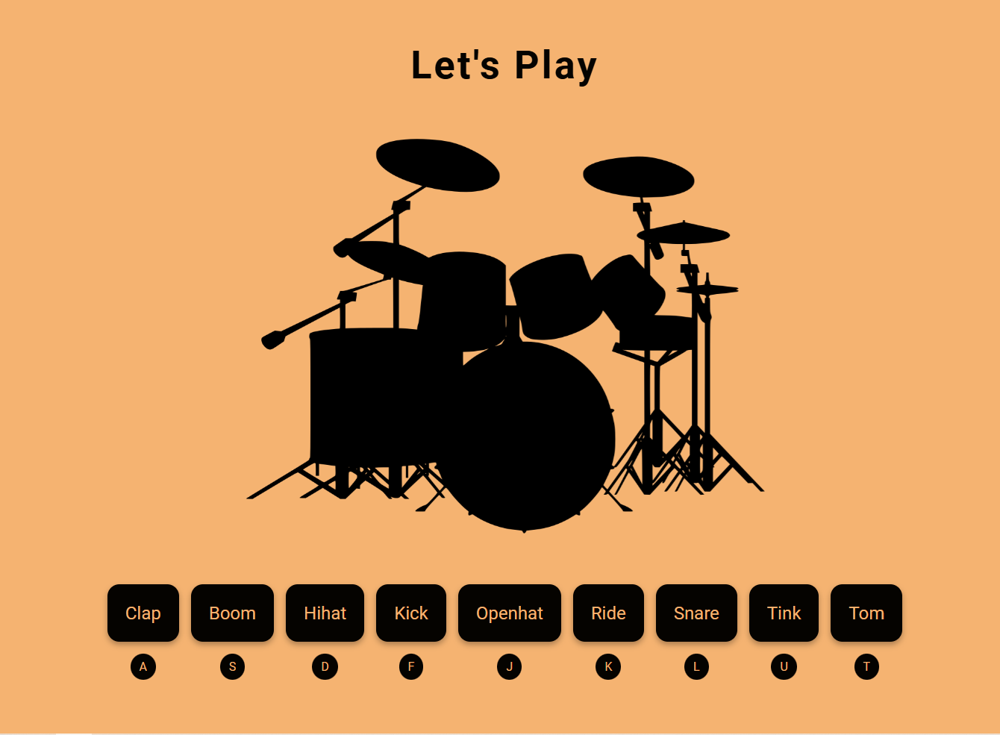

# DrumKit Uygulaması (TR)
Bu proje, HTML, CSS ve JavaScript kullanılarak oluşturulmuş bir ses uygulamasıdır. 9 farklı butona tıklandığında veya ilgili harflere basıldığında, her butona atanmış ses dosyaları çalınır. Ayrıca, butona tıklandığında veya klavyede harfe basıldığında buton küçülüp büyüme animasyonu ile görsel bir efekt oluşturur.

## Proje Yapısı
Proje şu üç ana dosyadan oluşmaktadır:

- **index.html:** HTML yapısını içerir. Butonlar ve ses dosyaları burada tanımlanmıştır.
- **style.css:** Projenin stilini belirler. Butonların görünümü ve animasyonlar burada tanımlanmıştır.
- **script.js:** JavaScript dosyası, butonlara tıklandığında veya klavyede ilgili tuşa basıldığında sesleri çalar ve animasyonları tetikler.

## Özellikler
- 9 farklı ses butonu.
- Butona tıklandığında veya klavyeden ilgili tuşa basıldığında ses oynatılır.
- Butonlar, tıklama veya tuş basma olayında küçülüp büyüme animasyonuyla görsel efekt sağlar.

## Kullanım

1. Web adresini açın. ***https://ozgurdayanir.github.io/drumkit/***
2. Butonlara tıklayarak veya ilgili harflere (A, S, D, F, G, H, J, K, L) basarak sesleri çalabilirsiniz.
3. Butonlar tıklandığında veya tuşlara basıldığında görsel bir küçülme/büyüme efekti göreceksiniz.